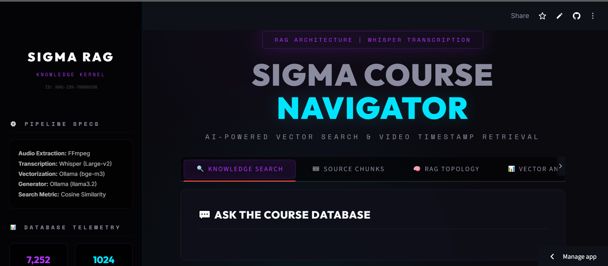
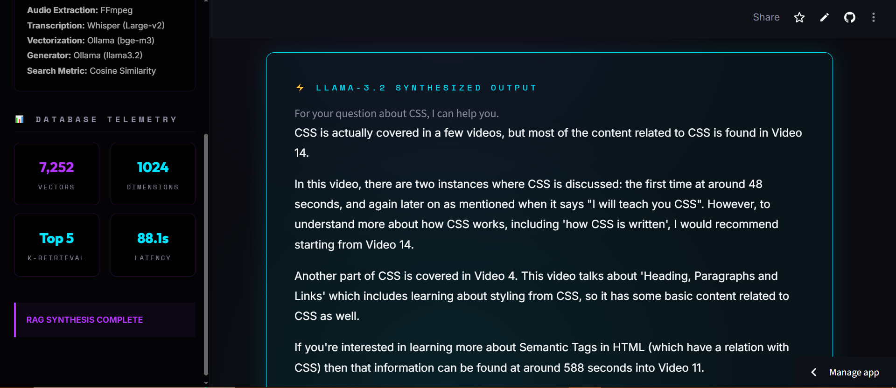
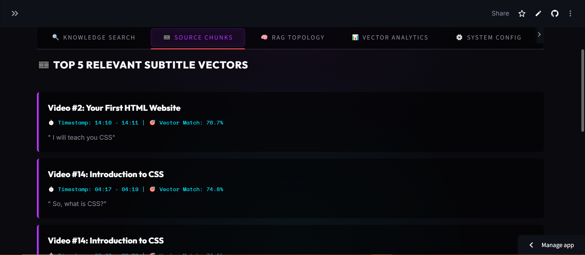
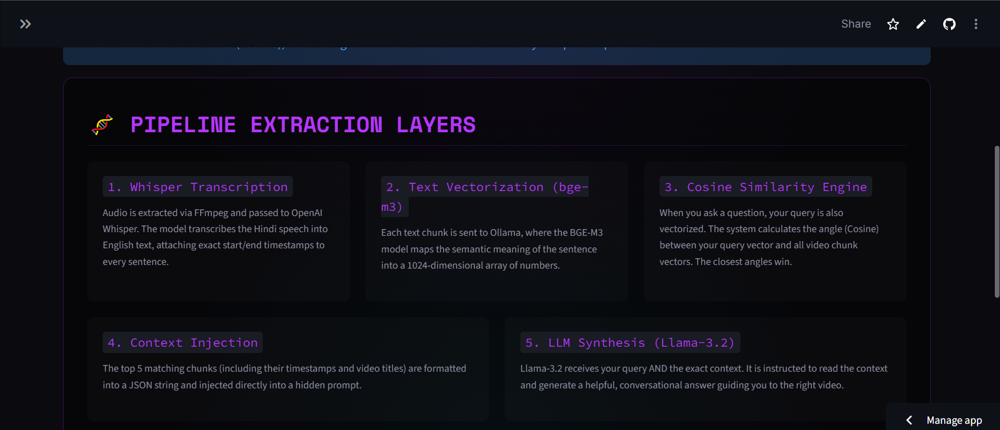

# 🎓 Sigma Course Assistant: Video-to-Text RAG Pipeline

Deployment Link :- 

embedding.joblib Link :- https://drive.google.com/file/d/1DdbVHNfp-xb-A9sKPZEkTxbGcxuaXwYG/view?usp=sharing

#UI

## 📌 Project Overview
The **Sigma Course Assistant** is a fully localized Retrieval-Augmented Generation (RAG) system designed to solve the "needle in a haystack" problem for students navigating massive video courses. 

Instead of manually scrubbing through hours of video to find specific topics, students can ask natural language questions. The system searches through transcribed, vectorized video chunks and uses a local LLM (`llama3.2`) to tell the student exactly **which video** and at **what exact timestamp** the topic is taught.

## 🚀 Pipeline Architecture
This project processes raw `.mp4` video files into a searchable, AI-driven knowledge base across 4 distinct phases:

1. **🎬 Audio Extraction (`videos_to_mp3.py`):** Uses `ffmpeg` to strip audio from course videos, intelligently extracting the tutorial number and title directly from the filename.
2. **📝 Transcription & Chunking (`mp3_to_json.py`):** Utilizes OpenAI's `Whisper` (Large-v2) to transcribe the audio (translated to Hindi). It segments the text and captures precise `start` and `end` timestamps, saving the structured metadata as JSON.
3. **🧠 Vectorization (`preprocess_json.py`):** Connects to a local **Ollama** instance to generate high-dimensional text embeddings using the `bge-m3` model. The vectors and metadata are stored in a Pandas DataFrame and serialized via `joblib` for rapid retrieval.
4. **🔍 RAG Inference (`process_incoming.py`):** Accepts student queries, calculates Cosine Similarity against the vectorized database, retrieves the Top-5 most relevant video chunks, and injects them into a prompt for `llama3.2` to generate a helpful, conversational guide.

## 📁 Repository Structure

📦 Sigma-Course-RAG

    ┣ 📂 videos/              # Raw input course videos (e.g., "Tutorial [01] #1 ｜ Setup.mp4")
    ┣ 📂 audios/              # Extracted .mp3 files
    ┣ 📂 jsons/               # Whisper transcription chunks with timestamps
    ┣ 📜 videos_to_mp3.py     # Phase 1: FFmpeg Extraction
    ┣ 📜 mp3_to_json.py       # Phase 2: Whisper Transcription
    ┣ 📜 preprocess_json.py   # Phase 3: Embedding Generation
    ┣ 📜 process_incoming.py  # Phase 4: LLM Query Inference
    ┣ 📜 embeddings.joblib    # Serialized vector database
    ┗ 📜 README.md            # System documentation

🛠️ Prerequisites & Installation
1. System Dependencies
   
        FFmpeg: Must be installed on your system and added to your system's PATH.
        
        Windows: winget install ffmpeg or download from the official site.
        
        Linux/Mac: sudo apt install ffmpeg or brew install ffmpeg
        
        Ollama: Download and install Ollama to run local LLMs.

3. Pull Local LLM Models

4. Start your Ollama server, open your terminal, and pull the required embedding and generation models:
   
        ollama pull bge-m3
        ollama pull llama3.2

3. Python Environment Setup
Clone the repository and install the required Python packages:

        git clone [https://github.com/akshitgajera1013/RAG_Based_AI_System.git](https://github.com/akshitgajera1013/RAG_Based_AI_System.git)
        cd RAG_Based_AI_System
        python -m venv venv
        source venv/bin/activate  # On Windows: venv\Scripts\activate
        pip install openai-whisper pandas numpy scikit-learn requests joblib

🏃‍♂️ Running the Pipeline
Step 1: Extract Audio
Place your .mp4 course files in the videos/ directory and run:

    python videos_to_mp3.py

Step 2: Generate Transcripts

    python mp3_to_json.py

Step 3: Build the Vector Database
Ensure Ollama is running in the background, then execute:

    python preprocess_json.py

Step 4: Ask Questions!
Launch the inference engine to test the RAG system:

    python process_incoming.py

The terminal will prompt you to "Ask a Question:". The LLM will then output the exact video title and timestamps where your query is discussed!
