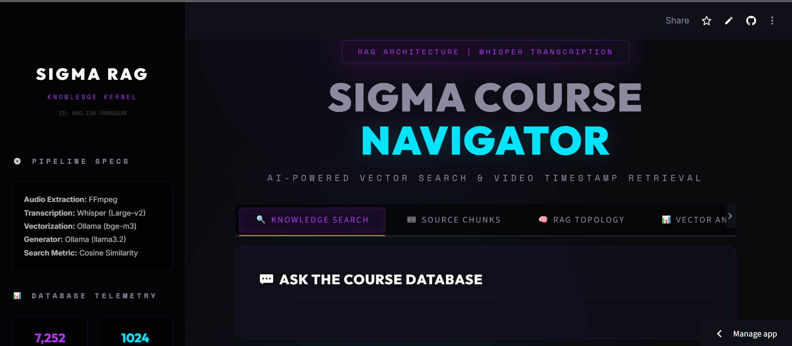
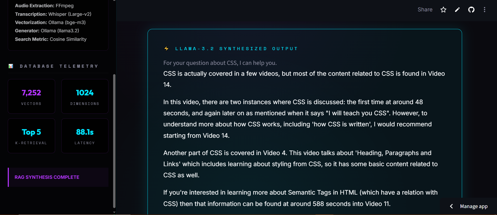
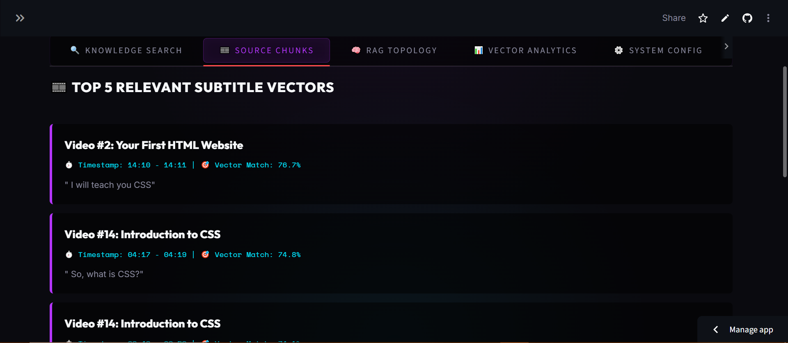
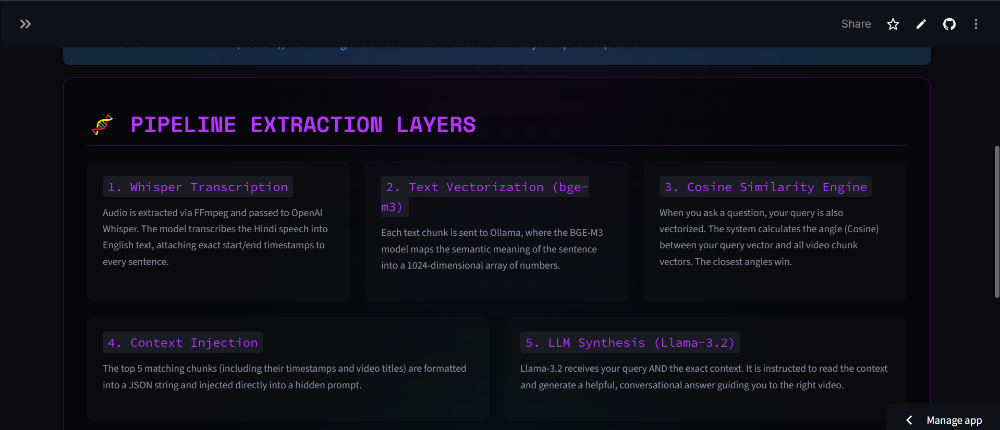

<div align="center">

# 🎓 Sigma Course Assistant
### A Video-to-Text RAG Pipeline for Intelligent Course Navigation

[](https://python.org)
[](https://ollama.com)
[](https://github.com/openai/whisper)
[](https://scikit-learn.org)
[](https://ffmpeg.org)
[](https://streamlit.io)

**Stop scrubbing through hours of video. Ask a question. Get the exact timestamp.**

[🚀 Live Demo](https://ragbasedaisystem-5twct2vzcou9c6sdj4jsnp.streamlit.app/) · [📦 Download Embeddings](https://drive.google.com/file/d/1DdbVHNfp-xb-A9sKPZEkTxbGcxuaXwYG/view?usp=sharing) · [Report Bug](https://github.com/akshitgajera1013/RAG_Based_AI_System/issues)

</div>

---

## 📌 Overview

**Sigma Course Assistant** is a fully local Retrieval-Augmented Generation (RAG) system that solves the "needle in a haystack" problem for students navigating large video courses.

Instead of manually scrubbing through hours of content, students simply ask a natural language question. The system searches through transcribed, vectorized video chunks and uses a local LLM (`llama3.2`) to return the **exact video title** and **precise timestamp** where the topic is taught — all without sending any data to the cloud.

### ✨ Key Features

- 🔒 **Fully Local** — No API keys, no cloud dependency. Runs entirely on your machine via Ollama.
- 🎯 **Timestamp-Level Precision** — Pinpoints the exact moment in a video where your topic is discussed.
- 🌐 **Multilingual Support** — Whisper transcription with Hindi translation out of the box.
- ⚡ **Fast Retrieval** — Pre-computed embeddings with cosine similarity for near-instant search.
- 🖥️ **Streamlit UI** — Clean, interactive web interface for querying the knowledge base.

---

## 🖼️ Screenshots

| Home | Query Results |
|------|---------------|
|  |  |
|  |  |

---

## 🏗️ Architecture

The system processes raw `.mp4` video files into a searchable, AI-powered knowledge base through 4 sequential phases:

```
📹 Raw Videos (.mp4)
      │
      ▼
┌─────────────────────────────┐
│  Phase 1: Audio Extraction  │  videos_to_mp3.py  →  FFmpeg
│  .mp4 → .mp3                │
└─────────────┬───────────────┘
              │
              ▼
┌──────────────────────────────────┐
│  Phase 2: Transcription          │  mp3_to_json.py  →  Whisper (large-v2)
│  .mp3 → .json (with timestamps)  │
└──────────────┬───────────────────┘
               │
               ▼
┌──────────────────────────────────────┐
│  Phase 3: Vectorization              │  preprocess_json.py  →  Ollama (bge-m3)
│  .json → embeddings.joblib           │
└────────────────┬─────────────────────┘
                 │
                 ▼
┌──────────────────────────────────────────────┐
│  Phase 4: RAG Inference                      │  process_incoming.py  →  llama3.2
│  Query → Cosine Similarity → Top-5 Chunks    │
│         → LLM Response (Video + Timestamp)   │
└──────────────────────────────────────────────┘
```

| Phase | Script | Tool | Description |
|-------|--------|------|-------------|
| 1 | `videos_to_mp3.py` | FFmpeg | Strips audio from `.mp4` files, parsing tutorial number and title from filenames |
| 2 | `mp3_to_json.py` | Whisper large-v2 | Transcribes audio to text with `start`/`end` timestamps, saved as structured JSON |
| 3 | `preprocess_json.py` | Ollama `bge-m3` | Generates high-dimensional embeddings via local Ollama; serializes vectors to `embeddings.joblib` |
| 4 | `process_incoming.py` | Ollama `llama3.2` | Embeds query, retrieves Top-5 chunks via cosine similarity, generates a guided response |

---

## 📁 Project Structure

```
RAG_Based_AI_System/
├── 📂 videos/                  # Raw input course videos (.mp4)
├── 📂 audios/                  # Extracted audio files (.mp3)
├── 📂 jsons/                   # Whisper transcription chunks with timestamps
├── 📂 images/                  # UI screenshots for README
├── 📜 videos_to_mp3.py         # Phase 1: Audio extraction via FFmpeg
├── 📜 mp3_to_json.py           # Phase 2: Transcription via Whisper
├── 📜 preprocess_json.py       # Phase 3: Embedding generation via Ollama
├── 📜 process_incoming.py      # Phase 4: RAG query inference
├── 📜 embeddings.joblib        # Pre-built serialized vector database
├── 📜 app.py                   # Streamlit web interface
└── 📜 README.md
```

---

## ⚙️ Prerequisites

### System Dependencies

**FFmpeg** — Required for audio extraction.

```bash
# Windows
winget install ffmpeg

# macOS
brew install ffmpeg

# Linux
sudo apt install ffmpeg
```

**Ollama** — Required for local LLM inference. [Download here](https://ollama.com/download), then pull the required models:

```bash
ollama pull bge-m3       # Embedding model
ollama pull llama3.2     # Generation model
```

> ⚠️ Make sure the Ollama server is running before executing Phases 3 and 4.

---

## 🚀 Getting Started

### 1. Clone the Repository

```bash
git clone https://github.com/akshitgajera1013/RAG_Based_AI_System.git
cd RAG_Based_AI_System
```

### 2. Set Up Python Environment

```bash
python -m venv venv

# Activate (Linux/macOS)
source venv/bin/activate

# Activate (Windows)
venv\Scripts\activate

pip install openai-whisper pandas numpy scikit-learn requests joblib streamlit
```

### 3. Run the Pipeline

> **Skip to Step 4** if you just downloaded the pre-built `embeddings.joblib` from the link above.

**Phase 1 — Extract Audio**

Place your `.mp4` course files inside the `videos/` directory, then run:

```bash
python videos_to_mp3.py
```

**Phase 2 — Transcribe Audio**

```bash
python mp3_to_json.py
```

**Phase 3 — Build the Vector Database**

Ensure Ollama is running, then:

```bash
python preprocess_json.py
```

**Phase 4 — Query the System**

```bash
python process_incoming.py
```

You'll be prompted with `Ask a Question:`. The LLM will return the exact video title and timestamp where your topic is taught.

### 4. Launch the Web UI (Optional)

```bash
streamlit run app.py
```

Or visit the [live hosted demo](https://ragbasedaisystem-5twct2vzcou9c6sdj4jsnp.streamlit.app/) directly.

---

## 💡 Example Usage

```
Ask a Question: How do I use useState hook in React?

📹 Answer:
The topic "useState Hook" is covered in:
  → Tutorial [12] | React Hooks Introduction
    ⏱ Timestamp: 4:32 – 7:15

  → Tutorial [14] | State Management Basics
    ⏱ Timestamp: 1:10 – 3:45
```

---

## 🛠️ Tech Stack

| Component | Technology |
|-----------|------------|
| Audio Extraction | FFmpeg |
| Speech-to-Text | OpenAI Whisper (large-v2) |
| Text Embeddings | Ollama `bge-m3` |
| LLM Generation | Ollama `llama3.2` |
| Similarity Search | Scikit-Learn (Cosine Similarity) |
| Data Serialization | Pandas + Joblib |
| Web Interface | Streamlit |

---

## 🤝 Contributing

Contributions are welcome! If you find a bug or have a feature request, please open an [issue](https://github.com/akshitgajera1013/RAG_Based_AI_System/issues).

1. Fork the repository
2. Create a feature branch (`git checkout -b feature/your-feature`)
3. Commit your changes (`git commit -m 'Add your feature'`)
4. Push to the branch (`git push origin feature/your-feature`)
5. Open a Pull Request

---


<div align="center">
Made with ❤️ by <a href="https://github.com/akshitgajera1013">Akshit Gajera</a>
</div>


